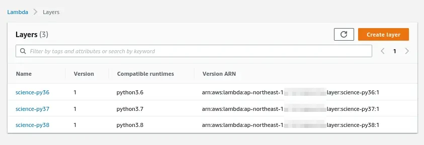

# lampip: Simple CLI tool for creating python custom lambda layers

[](https://python.org/pypi/lampip)
[](https://python.org/pypi/lampip)
[](https://python.org/pypi/lampip)
[](https://github.com/hayashiya18/lampip/actions/workflows/python-package.yml)

---

## Features

- Build Python(3.6, 3.7, 3.8)-compatible custom lambda layers using Docker and pip, and push it to AWS.

## Requirements

- Python3
- Docker
- AWS Account

## Installation

You can obtain this packages using pip.

```console
$ pip3 install lampip
```

Then you can use `lampip` command.

```console
$ lampip --help
Usage: lampip [OPTIONS] COMMAND [ARGS]...

  Simple CLI tool for creating python custom lambda layers

Options:
  --version  Show the version and exit.
  --help     Show this message and exit.

Commands:
  deploy  Build and push lambda layer
  new     Create the scaffold

```

## Usage

At the first create the scaffold

```console
$ lampip new science
```

Go to the generated directory

```console
$ cd science
$ ls
requirements.txt  lampip-config.toml
```

Edit `requirements.txt`

```text
numpy
scipy
pandas
```

Edit `lampip-config.toml`

```toml
[lampip.config]
layername = "science"
description = "numpy, scipy, and pandas"
pyversions = ["3.8", "3.7", "3.6"]
```

Before you deploy the lambda layer, be sure you have AWS credentials configured.

```console
(If you do not configure AWS credentials yet, ...)
$ aws configure
AWS Access Key ID: ?????
AWS Secret Acess Key: ?????
Default region name: ?????
```

(Option) You can switch the aws credentials using environments variables.

```console
(Case1: Using AWS CLI profile)
$ export AWS_PROFILE="subaccount"

(Case2: Using AWS access key directly)
$ export AWS_ACCESS_KEY_ID=????
$ export AWS_SECRET_ACCESS_KEY=?????
$ export AWS_DEFAULT_REGION=?????
```

Deploy

```console
$ lampip deploy
```

Then you can check deployed layers on AWS Console.


